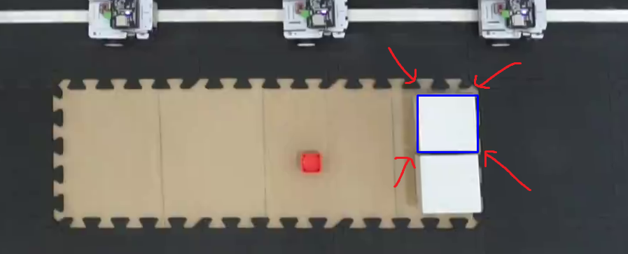
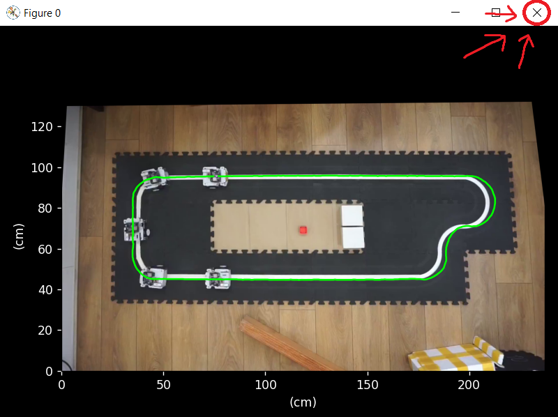

# zTracking

This project is designed to visualize and measure, via image processing, the distances between cars in a platooning on a circuit.

Instructions for its use are separated into four sections:
* Installation
* Cropping
* Write CSV
* Read CSV and results

### Instructions
#### Installation
##### Install Virtualenv
```
pip install virtualenv
```
##### Create environment in repository folder
```
virtualenv zTracking
```
##### Activate enfironmen
```
zTracking\Scripts\Activate
```
##### Install requirements
```
pip install -r requirements.txt
```

#### Cropping
* Download Kdenlive (open source software).
* Drag video into Kdenlive and switch profile to 1080i (if videos are interlaced)


* Right click -> Cut Clip to cut the video at the start and end of a lap once the cars are moving. This is done to create a coordinate map of the track.


* Cut clip at the star of a lap

* Cut clip at the end of a lap


#### Write CSV

`writeTrack.py` is used to create a coordinate map of the track from a cropped video of one lap.
```
python writeTrack.py --fileName "crop.mp4" --outputName "trackPoints.csv"
```

* `fileName` is the cropped video containing one lap.
* `outputName` is the name of the output CSV file which contains the track coordinates

Once the script is running, a window with the first frame of the video will appear. Select four points that make a rectangle in order to make a perspective transform.


Select a box at the centre of the track for a pixel to centimetres conversion


Select a trackable area from the frontalmost car


#### Read CSV

`readTrack.py` is used to read a coordinate map of a track and a video
```
python writeTrack.py --fileName "prueba_1.mp4" --trackName "trackPoints.csv" --outputName "results.csv"
```
* `fileName` is the video containing an experiment.
* `trackName` is the name of the input CSV file which contains the track coordinates
* `outputName` is a CSV file containing the distances between cars taken from the input video

Once the script is running, select a box at the centre of the track for a pixel to centimetres conversion


A window with a plot of the track will appear. Close it.


Select a trackable area from each car, from left to right

